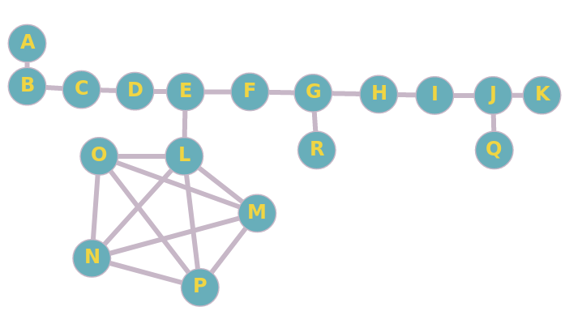

# Tarjan's Algorithm Benchmark. C++ vs. Java.

The main goal of the project was to compare these implementations of Tarjan's algorithm which is important during searching for bridges in a graph. 

## Details

Tests were performed on a single computer with the environment prepared both for JVM and GCC.

The main idea was to prepare and run input data in the same format - big graph made of other subgraphs which have structure like:

- line
- star
- full graph
- randomly added bridges.

The potential output could be like below. Let's note that this graphs consists of: *root node A, 10-element line, 2 randomly added bridges and full graph.*

*(image generated thanks to: graphonline.ru)*

## C++ Implementation

[How to use](cpp)

**Features**

- free of memory leaks
- based on *STL*
- used smart pointers
- benchmarked with *google benchmark*

## Java Implementation

**Features**

- functional approach
- plain structure
- benchmarked with *JMH*

## Input

Two graph **generators**:

- `generator.py` in `generator` folder
- `generate_graphs.py`  in `scripts` folder

were provided. Feel free to test both on your own.